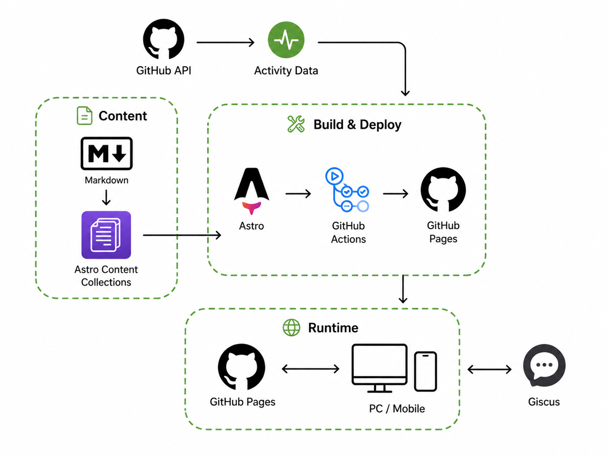

<div align="center">

# devjune.dev

Java, Spring, JPA, HTTP, 네트워크와 인프라를 공부하며  
이해한 개념과 프로젝트에서 확인한 내용을 기록하는 개인 기술 블로그입니다.

**[🌐 Blog](https://guseoh.github.io/)**

</div>

<br />

## About

학습한 내용을 단순히 모아두기보다, 나중에 다시 읽었을 때  
**왜 그렇게 동작하는지 설명할 수 있는 기록**을 남기는 것을 목표로 합니다.

Java와 Spring 백엔드 개발을 중심으로 학습하고 있으며,  
JPA, Spring Security, HTTP·Network, Database, Infra 등으로 학습 범위를 확장하고 있습니다.

<br />

## Highlights

### 📖 Reading

<!-- 이미지 추가 후 주석 해제
<p align="center">
  
</p>
-->

목차, 읽기 진행률, 코드 하이라이팅과 관련 글 탐색을 지원해  
긴 기술 글에서도 필요한 내용을 쉽게 찾을 수 있도록 구성했습니다.

### 🔎 Explore

<!-- 이미지 추가 후 주석 해제
<p align="center">
  
</p>
-->

본문 검색과 Category, Tag를 이용해 이전에 학습한 내용을 다시 찾을 수 있습니다.

### 🌓 Theme

<!-- 이미지 추가 후 주석 해제
<p align="center">
  
</p>
-->

Light / Dark Mode와 반응형 레이아웃을 지원해  
데스크톱과 모바일 환경 모두에서 사용할 수 있습니다.

<br />

## How it works

<p align="center">
  
</p>

글은 **Markdown**으로 작성하고 **Astro Content Collections**에서 관리합니다.

Astro가 콘텐츠를 정적 페이지로 생성하며,  
GitHub Actions에서 검증과 빌드를 수행한 뒤 **GitHub Pages**에 배포합니다.

GitHub 활동 데이터는 빌드 과정에서 반영하고,  
댓글은 **Giscus**를 통해 GitHub Discussions와 연결합니다.

<br />

## Built with

### Core


### Delivery


### Quality


### Integration


<br />

## Development

로컬 개발 서버를 실행합니다.

```bash
npm ci
npm run dev
```

프로덕션 빌드:

```bash
npm run build
```

기본 검증:

```bash
npm run content:check
npm run check
npm test
npm run links:check
npm run build
```
