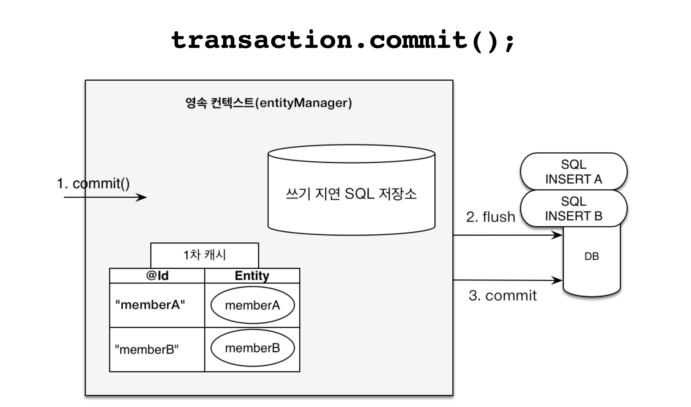

## 1. 영속성 컨텍스트와 엔티티 상태

영속성 컨텍스트(Persistence Context)는 **엔티티를 관리하는 논리적인 공간**이다. 애플리케이션은 `EntityManager`를 통해 이 공간에 접근한다.

객체를 생성하기만 한 상태에서는 JPA가 해당 객체를 관리하지 않는다.

```java
Member member = new Member();
member.setId("member1");
member.setUsername("회원1");
```

이 상태를 **비영속(new/transient)** 이라고 한다.

`persist()` 를 호출하면 엔티티가 영속성 컨텍스트의 관리 대상이 된다.

```java
em.persist(member);
```

이제 `member`는 **영속(managed)** 상태이다.

엔티티의 생명주기는 네 가지로 구분할 수 있다.

- **비영속**: 영속성 컨텍스트와 관계가 없는 상태
- **영속**: 영속성 컨텍스트가 관리하는 상태
- **준영속**: 관리되던 엔티티가 영속성 컨텍스트에서 분리된 상태
- **삭제**: 삭제 대상으로 등록된 상태


  
<details>
    <summary>준영속</summary>
<div markdown="1">


```java
em.detach(member); // 특정 엔티티만 준영속 상태로 전환

em.clear();        // 영속성 컨텍스트의 모든 엔티티를 준영속 상태로 전환

em.close();        // 영속성 컨텍스트 종료
```

준영속 상태는 엔티티 객체는 존재하지만 영속성 컨텍스트가 더 이상 추적하고 관리하지 않는 상태이다.

</div>
</details>

1차 캐시와 변경 감지처럼 JPA가 제공하는 상태 관리 기능은 영속성 컨텍스트가 관리하는 엔티티를 중심으로 동작한다.


## 2. 1차 캐시와 동일성

영속성 컨텍스트는 관리하는 엔티티를 **1차 캐시**에 보관한다.

앞에서 `persist()`한 `member1`을 다시 조회하면 1차 캐시를 확인한다.

```java
Member findMember = em.find(Member.class, "member1");
```


이미 1차 캐시에 있다면 DB에 SELECT SQL을 보내지 않고 관리 중인 엔티티를 반환한다.

반대로 1차 캐시에 없는 식별자를 조회하면 DB까지 내려간다.

```java
Member findMember2 = em.find(Member.class, "member2");
```

DB에서 조회한 `member2`는 바로 반환되는 것으로 끝나지 않고 1차 캐시에 저장된다. 이후 같은 식별자를 다시 조회하면 영속성 컨텍스트가 관리하던 객체를 사용할 수 있다.

그래서 같은 영속성 컨텍스트에서 동일한 식별자의 엔티티를 조회하면 객체의 동일성도 유지된다.

```java
Member a = em.find(Member.class, "member1");
Member b = em.find(Member.class, "member1");

System.out.println(a == b); // true
```

1차 캐시의 의미를 단순한 조회 성능 향상으로만 보면 부족하다. **같은 식별자의 엔티티를 하나의 객체로 관리해야 이후 상태 변화도 일관되게 추적**할 수 있다.

## 3. 쓰기 지연

엔티티를 등록했다고 해서 변경 SQL을 그 자리에서 모두 DB로 보낼 필요는 없다.

```java
EntityTransaction transaction = em.getTransaction();
transaction.begin();

em.persist(memberA);
em.persist(memberB);

transaction.commit();
```

JPA는 트랜잭션 안의 변경 작업을 관리하고, DB와 동기화해야 할 시점까지 SQL을 미룰 수 있다. 이를 **트랜잭션을 지원하는 쓰기 지연(transactional write-behind)** 이라고 한다.

### 3.1 동작 구조와 원리



`persist()`를 호출하면 엔티티가 영속성 컨텍스트의 **1차 캐시**에 저장되고, 필요한 `INSERT` SQL은 **쓰기 지연 SQL 저장소**에 모아둔다.

## 4. 변경 감지

영속 상태의 엔티티는 값을 수정하기 위해 별도의 update() 메서드를 호출하지 않는다.

```java
Member memberA = em.find(Member.class, "memberA");

memberA.setUsername("hi");
memberA.setAge(10);

// em.update(memberA);
```

`EntityManager`에는 영속 엔티티를 수정하기 위한 `update()`가 없다.

영속성 컨텍스트가 엔티티를 관리하기 시작할 때 비교에 초기 상태를 보관하기 때문이다. 이 상태를 **스냅샷(Snapshot)** 이라고 한다.


플러시가 발생하면 현재 엔티티의 값과 스냅샷을 비교한다. 값이 달라졌다면 변경된 엔티티로 판단하고 `UPDATE SQL`을 생성한다.

이 과정이 **변경 감지(Dirty Checking)** 이다.

## 5. 플러시

**플러시(flush)** 는 영속성 컨텍스트에 쌓인 변경 내용을 DB에 동기화하는 과정이다.

```java
em.flush();
```

이때 변경 감지가 수행되고, 등록·수정·삭제에 필요한 SQL이 DB로 전달된다.

플러시는 영속성 컨텍스트를 초기화하지 않고, 엔티티와 1차 캐시는 그대로 유지되며 DB와 변경 내용만 맞춘다.

플러시가 필요한 대표적인 시점이다.

- `em.flush()`를 직접 호출할 때
- 트랜잭션을 커밋할 때
- 기본 flush 모드에서 쿼리 결과에 현재 변경이 영향을 주는 JPQL을 실행할 때

```java
em.persist(memberA);
em.persist(memberB);
em.persist(memberC);

List<Member> members = em.createQuery(
    "select m from Member m",
    Member.class
).getResultList();
```

DB를 조회하는 쿼리가 영속성 컨텍스트의 변경을 보지 못하면 현재 작업 상태와 조회 상태가 어긋날 수 있다. 기본 `FlushModeType.AUTO` 에서는 쿼리 결과에 영향을 주는 변경이 보이도록 JPA 구현체가 동기화를 보장한다.

`flush()`와 `commit()`은 역할이 다릅니다. flush는 변경 SQL을 DB에 전달하지만 트랜잭션을 확정하지 않는다. 최종 확정은 commit에서 이루어진다.

> [!note] 쿼리 결과에 영향을 주는 변경
> JPQL이 변경 쿼리라는 뜻이 아니라, JPQL 실행 전에 쌓여 있는 변경사항이 SELECT 결과에 영향을 준다는 뜻이다.

## 6. 참고 자료
- [자바 ORM 표준 JPA 프로그래밍](https://product.kyobobook.co.kr/detail/S000000935744)
