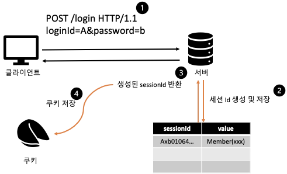
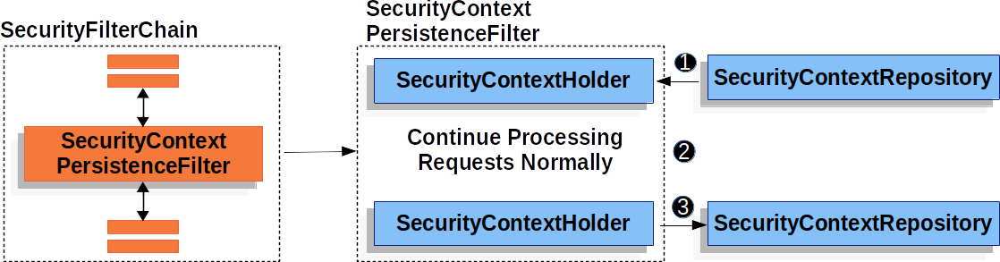

## 1. 들어가기 전

사용자가 로그인에 성공하면 서버는 아이디와 비밀번호를 확인해 사용자의 신원을 식별한다. 하지만 로그인 요청이 끝난 뒤 게시글 작성이나 회원 정보 조회처럼 새로운 요청이 들어오면, 서버는 그 요청이 조금 전에 로그인한 사용자에게서 온 것인지 다시 알아내야 한다.

HTTP는 기본적으로 **무상태(Stateless)** 특성을 가진다. 각 요청은 독립적으로 전달되므로, 이전 로그인 요청에서 확인한 사용자 정보가 다음 요청에 자동으로 포함되지는 않는다.

> [!note]
> 무상태라는 말이 서버가 어떤 상태도 저장할 수 없다는 뜻은 아니다. HTTP 요청 자체가 이전 요청의 상태를 자동으로 이어 주지 않기 때문에, 로그인 상태가 필요하다면 쿠키와 세션 같은 별도의 방법으로 연결해야 한다.

로그인 상태를 이어 가려면 브라우저와 서버가 역할을 나누어야 한다.

- 서버는 로그인한 사용자의 상태를 보관한다.
- 브라우저는 이후 요청에서 서버가 해당 상태를 찾을 수 있는 값을 전달한다.
  
세션 기반 인증에서는 **세션이 서버의 로그인 상태를 보관하고, 쿠키가 세션을 식별하는 값을 요청마다 전달한다.**

## 2. 쿠키와 세션은 서로 다른 역할을 맡는다

쿠키와 세션은 로그인 상태를 유지할 때 함께 등장하지만 데이터가 보관되는 위치와 책임이 다르다. **쿠키는 브라우저가 관리하는 데이터**이고, **세션은 서버가 여러 요청 사이에서 유지하는 상태**다.

세션 기반 인증에서 브라우저는 보통 사용자 정보나 비밀번호를 직접 보관하지 않는다. 대신 서버가 발급한 세션 ID를 쿠키에 저장하고, 실제 로그인 상태는 서버의 세션에 남겨 둔다.

> [!IMPORTANT]
> 세션 ID는 인증된 사용자 정보 자체가 아니다. 브라우저가 전달한 세션 ID를 이용해 서버에 저장된 로그인 상태를 찾는다.

### 2.1 쿠키는 브라우저와 서버 사이에서 값을 전달한다

서버는 HTTP 응답의 `Set-Cookie` 헤더를 사용해 브라우저에 쿠키를 저장하도록 요청할 수 있다.

```http
HTTP/1.1 200 OK
Set-Cookie: JSESSIONID=4F91A2C8D7E6; Path=/; HttpOnly
```

브라우저는 응답으로 받은 쿠키를 저장해 두었다가 도메인과 경로 등의 조건이 일치하는 후속 요청에 `Cookie` 헤더로 포함한다.

```http
GET /posts/new HTTP/1.1
Host: example.com
Cookie: JSESSIONID=4F91A2C8D7E6
```

애플리케이션 코드가 요청마다 쿠키를 직접 붙이는 방식은 아니다. 브라우저가 쿠키의 `Domain`, `Path`, `Expires`, `Max-Age`, `SameSite` 같은 속성을 확인한 뒤 전송 여부를 결정한다. 쿠키가 응답에서 생성되고 이후 요청으로 돌아오는 기본 규칙은 [MDN의 HTTP 쿠키 문서](https://developer.mozilla.org/ko/docs/Web/HTTP/Guides/Cookies)와 [Set-Cookie 문서](https://developer.mozilla.org/ko/docs/Web/HTTP/Reference/Headers/Set-Cookie)에서 확인할 수 있다.

### 2.2 세션은 서버에서 로그인 상태를 보관한다

세션은 서버가 여러 HTTP 요청 사이에서 사용자 상태를 유지하기 위한 저장 공간이다. 사용자가 인증되면 서버는 해당 사용자와 연결된 세션을 만들고, 이후 요청을 처리하는 데 필요한 상태를 저장할 수 있다.

세션 기반 인증에서는 세션에 인증과 관련된 상태가 저장될 수 있다.

- 인증된 사용자
- 사용자의 역할과 권한
- 로그인 상태
- 요청 사이에 유지해야 하는 값

각 세션에는 고유한 세션 ID가 부여된다. 브라우저가 세션 ID를 보내면 서버는 그 값을 키로 세션을 조회하고, 로그인할 때 저장한 사용자 상태를 다시 사용한다.

Servlet 기반 웹 애플리케이션에서는 세션 ID를 전달하는 쿠키 이름으로 흔히 `JSESSIONID`를 사용한다. 다만 쿠키 이름은 사용 중인 서버나 세션 구현에 따라 달라질 수 있다.

> [!NOTE]
> 브라우저에 저장되는 `세션 쿠키(Session Cookie)`와 서버의 HTTP 세션은 서로 다른 개념이다. 세션 쿠키는 별도의 만료 시각 없이 브라우저 세션 동안 유지되는 쿠키를 뜻하고, HTTP 세션은 서버가 관리하는 사용자별 상태를 의미한다.

### 2.3 쿠키와 세션이 함께 로그인 상태를 유지한다

| 구분 | 쿠키 | 세션 |
| --- | --- | --- |
| 관리 위치 | 브라우저 | 서버 |
| 세션 기반 인증에서 저장하는 값 | 세션 ID | 로그인한 사용자 상태 |
| 요청 사이의 역할 | 세션 ID 전달 | 인증 상태 유지 |
| 서버가 확인하는 대상 | 요청에 포함된 쿠키 | 세션 ID에 연결된 데이터 |

서버에 세션만 만들어 두면 어느 브라우저의 요청인지 구분할 수 없고, 브라우저가 세션 ID만 가지고 있어도 서버에 연결된 세션이 없다면 로그인 상태를 복원할 수 없다. **브라우저가 쿠키로 세션 ID를 전달하고, 서버가 그 ID로 세션을 조회하면서 로그인 상태가 이어진다.**

## 3. 세션 기반 인증은 로그인 이후에도 사용자를 식별한다

세션 기반 인증의 전체 과정은 로그인에 성공하는 시점과 그 이후에 보호된 기능을 요청하는 시점으로 나누어 볼 수 있다. 두 과정에서 브라우저가 전달하는 정보는 달라지지만, 서버가 최종적으로 확인하려는 대상은 동일하다. 현재 요청을 보낸 사용자가 누구인지 식별하는 것이다.

로그인할 때는 아이디와 비밀번호로 사용자의 신원을 처음 확인한다. 인증이 끝난 뒤에는 비밀번호를 반복해서 전송하지 않고, **서버가 발급한 세션 ID로 이미 만들어진 로그인 상태를 찾는다.**



### 3.1 로그인에 성공하면 세션 ID가 발급된다

사용자가 아이디와 비밀번호를 전송하면 서버는 저장된 회원 정보와 비교해 인증을 수행한다. **인증에 성공하면 서버는 로그인한 사용자의 상태를 세션에 저장하고, 브라우저가 해당 세션을 식별할 수 있도록 세션 ID를 전달**한다.


서버는 생성한 세션 ID를 `Set-Cookie` 응답 헤더에 담아 브라우저로 전달한다. 브라우저는 이를 쿠키 저장소에 보관하고 이후 요청에 사용할 준비를 한다.

```http
HTTP/1.1 302 Found
Location: /
Set-Cookie: JSESSIONID=4F91A2C8D7E6; Path=/; HttpOnly
```


이 시점부터 브라우저와 서버가 보관하는 값은 분리된다. **브라우저에는 세션 ID가 남고, 서버에는 그 ID와 연결된 인증 상태가 저장**된다. 아이디와 비밀번호는 사용자를 처음 인증하는 데 사용되며, 이후 요청에서 로그인 상태를 확인하기 위해 매번 다시 보내지는 않는다. 

Spring Security 공식문서의 [Persisting Authentication](https://docs.spring.io/spring-security/reference/servlet/authentication/persistence.html)에서는 로그인 전 요청, 인증 정보 제출, 새로운 세션 쿠키 발급, 이후 요청에서의 쿠키 전송 과정을 실제 HTTP 메시지 형태로 확인할 수 있다.


### 3.2 후속 요청에는 세션 ID 쿠키가 포함된다

로그인한 사용자가 게시글 작성 페이지를 요청하면 브라우저는 저장하고 있던 세션 ID를 Cookie 요청 헤더에 포함한다.

```http
GET /posts/new HTTP/1.1
Host: example.com
Cookie: JSESSIONID=4F91A2C8D7E6
```


서버는 전달받은 세션 ID로 세션 저장소를 조회한다. 유효한 세션이 발견되면 그 안에 저장된 인증 상태를 이용해 현재 사용자를 식별하고, 사용자가 게시글을 작성할 권리가 있는지 판단한다.

첫 번째 글에서 살펴본 인증과 인가는 이 과정 안에서 자연스럽게 이어진다. 로그인 시점에는 아이디와 비밀번호로 사용자를 인증하고, 인증 결과를 세션에 보관한다. 이후 요청에서는 세션을 이용해 사용자를 다시 식별한 뒤, 요청한 리소스와 동작을 기준으로 인가를 수행한다.

## 4. Spring Security는 인증 결과를 세션에 연결한다

일반적인 세션 기반 구성에서는 Spring Security가 로그인에 성공해 만들어진 인증 결과를 HTTP 세션과 연결한다. 브라우저가 세션 쿠키를 다시 보내면 서버는 해당 세션에서 인증 상태를 조회하고, 현재 요청에서 사용할 사용자 정보를 복원한다.

브라우저, 서버, Spring Security가 맡는 책임을 구분하면 다음과 같다.

- **브라우저**는 세션 ID 쿠키를 저장하고 조건에 맞는 요청에 포함한다.
- **서버**는 세션 ID와 연결된 HTTP 세션을 관리한다.
- **Spring Security**는 세션에 연결된 인증 결과를 현재 요청의 보안 처리에 사용한다.



Spring Security의 세션 기반 인증에서는 `HttpSessionSecurityContextRepository`가 `SecurityContext`와 `HttpSession`을 연결한다. `SecurityContext`에는 현재 사용자를 나타내는 `Authentication`이 포함되며, 복원된 인증 정보는 현재 요청에 대한 접근 권한을 판단할 때 사용된다.

> [!NOTE]
> **HTTP 세션**은 여러 HTTP 요청 사이에서 사용자 상태를 유지하기 위해 서버가 제공하는 저장 공간이다.
>
> ```
> HttpSession
> └─ SecurityContext
>    └─ Authentication
>       ├─ principal
>       ├─ authorities
>       └─ authenticated
> ```

### 4.1 로그아웃하거나 세션이 만료되면 로그인 상태도 끝난다

로그아웃 과정에서는 서버에 저장된 인증 상태를 제거하고 세션을 무효화할 수 있다. 세션의 유효 시간이 지나 서버가 해당 세션을 삭제한 경우에도 같은 결과가 발생한다.

브라우저가 이전에 발급받은 세션 ID를 다시 보내더라도 서버에서 연결된 세션을 찾지 못하면 인증 상태를 복원할 수 없다. 사용자는 인증되지 않은 상태로 처리되며, 보호된 기능에 접근하려면 다시 로그인해야 한다.

Spring Security는 로그아웃 시 `JSESSIONID` 쿠키를 삭제하도록 설정할 수 있으며, 세션 무효화와 쿠키 제거가 실제 실행 환경에서 기대한 대로 동작하는지는 함께 확인해야 한다. 관련 설정은
[Authentication Persistence and Session Management](https://docs.spring.io/spring-security/reference/servlet/authentication/session-management.html#clearing-session-cookie-on-logout)에서 살펴볼 수 있다.

> [!WARNING]
> 세션 ID 자체에 비밀번호가 포함되어 있지는 않지만, 서버에 저장된 인증 상태를 식별하는 값이므로 안전하게 보호해야 한다. HTTPS를 사용하고 `Secure`, `HttpOnly`, `SameSite` 같은 쿠키 속성도 함께 설정해야 한다.

쿠키 속성이 어떤 조건에서 전송과 접근을 제한하는지는 [MDN의 Set-Cookie 문서](https://developer.mozilla.org/ko/docs/Web/HTTP/Reference/Headers/Set-Cookie)에서 확인할 수 있다.

## 5. 정리

HTTP 요청은 이전 요청에서 확인한 로그인 상태를 자동으로 이어 주지 않는다. 세션 기반 인증은 브라우저와 서버가 서로 다른 정보를 관리하면서 이 문제를 해결한다.

- 서버는 세션에 인증된 사용자의 상태를 보관한다.
- 브라우저는 서버가 발급한 세션 ID를 쿠키에 저장한다.
- 이후 요청에서는 세션 ID 쿠키가 서버로 전달된다.
- 서버는 세션 ID로 인증 상태를 찾고 현재 사용자를 식별한다.
- Spring Security는 복원한 인증 정보를 인가 판단에 사용한다.

쿠키와 세션을 서로 경쟁하거나 대체 관계에 있는 기술로 보면 둘의 역할을 이해하기 어려워진다. 쿠키는 브라우저와 서버 사이에서 세션 ID를 전달하고, 세션은 서버에서 로그인 상태를 유지한다. 두 역할이 연결되어야 사용자는 요청마다 비밀번호를 다시 보내지 않고도 로그인 상태를 이어 갈 수 있다.

## 6. 참고 자료

- [Spring Security — Persisting Authentication](https://docs.spring.io/spring-security/reference/servlet/authentication/persistence.html)
- [Spring Security — Authentication Persistence and Session Management](https://docs.spring.io/spring-security/reference/servlet/authentication/session-management.html)
- [Spring Security — Servlet Authentication Architecture](https://docs.spring.io/spring-security/reference/servlet/authentication/architecture.html)
- [Spring Session — HttpSession Integration](https://docs.spring.io/spring-session/reference/http-session.html)
- [MDN — HTTP 쿠키](https://developer.mozilla.org/ko/docs/Web/HTTP/Guides/Cookies)
- [MDN — Cookie 요청 헤더](https://developer.mozilla.org/ko/docs/Web/HTTP/Reference/Headers/Cookie)
- [MDN — Set-Cookie 응답 헤더](https://developer.mozilla.org/ko/docs/Web/HTTP/Reference/Headers/Set-Cookie)
- [쿠키와 세션의 동작 원리와 세션의 구조](https://velog.io/@rlfrkdms1/%EC%BF%A0%ED%82%A4%EC%99%80-%EC%84%B8%EC%85%98%EC%9D%98-%EB%8F%99%EC%9E%91-%EC%9B%90%EB%A6%AC%EC%99%80-%EC%84%B8%EC%85%98%EC%9D%98-%EA%B5%AC%EC%A1%B0)
- [쿠키와 세션 그리고 로그인 동작 방법](https://cjh5414.github.io/cookie-and-session/)
- [로그인 처리 1 — 쿠키와 세션](https://catsbi.oopy.io/0c27061c-204c-4fbf-acfd-418bdc855fd8)