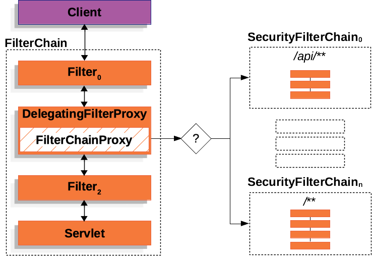

## 1. 들어가기 전

회원만 게시글을 작성할 수 있고 관리자만 공지를 삭제할 수 있는 서비스를 생각해 보자. 로그인 기능만 놓고 보면 사용자가 제출한 아이디와 비밀번호를 확인하고, 인증 결과를 세션에 저장하는 것만으로 구현할 수 있을 것처럼 보인다.

하지만 실제 서비스에서는 로그인 성공 여부만 확인해서 끝나지 않는다. 서버는 요청이 들어올 때마다 현재 사용자를 식별하고, 요청한 기능에 접근할 권한이 있는지 판단해야 한다. 인증되지 않은 사용자는 로그인 화면으로 보내야 하며, 권한이 부족한 사용자의 요청은 거부해야 한다. 로그아웃할 때는 인증 상태를 정리해야 하고, 비밀번호를 안전하게 저장하고 CSRF 같은 공격에도 대응해야 한다.

이 기능들을 Controller마다 직접 구현하면 코드가 빠르게 복잡해진다. 보안 검사가 여러 위치에 흩어지면서 어떤 요청에는 검사가 적용되고, 다른 요청에는 빠지는 실수도 발생할 수 있다.

Spring Security는 이런 문제를 해결하기 위해 **인증, 인가와 웹 보안 기능을 애플리케이션의 공통 처리 영역에서 일관되게 적용하는 프레임워크**다.

## 2. 보안 처리를 직접 구현하면 무엇이 문제일까?

인증과 인가는 개발자가 직접 구현할 수도 있다. 아이디와 비밀번호를 비교하고, 세션에서 회원 정보를 조회하여, 역할에 따라 조건문을 작성할 수도 있다.

문제는 기능 하나를 만드는 데 있지 않다. 서비스가 커질수록 동일한 보안 검사를 여러 요청에서 반복해야 하고, 서로 다른 개발자가 작성한 규칙을 일관되게 유지해야 한다. 보안 코드는 한 번의 누락이 곧 접근 제어 실패로 이어질 수 있기 때문에 일반적인 중복 코드보다 더 주의해서 관리해야 한다.

### 2.1 인증 확인이 여러 Controller에 반복된다

Spring Security 없이 로그인 사용자를 검사한다면 Controller에서 직접 세션을 조회할 수 있다.

```java
@GetMapping("/posts/new")
public String createForm(HttpSession session) {
    Object loginMember = session.getAttribute("loginMember");

    if (loginMember == null) {
        return "redirect:/login";
    }

    return "posts/createForm";
}
```

게시글 작성뿐 아니라 댓글 작성, 회원 정보 수정, 주문 조회에도 인증이 필요하다면 비슷한 코드가 각 Controller에 반복된다. 새로운 기능을 추가하면서 세션 확인을 빠뜨리면 인증되지 않은 사용자가 보호된 기능에 접근할 수도 있다.

공통 메서드로 추출하면 코드 중복은 줄일 수 있지만, 모든 개발자가 해당 메서드를 반드시 호출해야 한다는 조건은 여전히 남는다. **보안 검사가 개별 Controller의 구현 규칙에 의존한다는 점**이 근본적인 문제다.

### 2.2 인가 정책이 비즈니스 코드와 섞인다

인증된 사용자라고 해서 모든 작업을 수행할 수 있는 것은 아니다. 관리자는 공지를 삭제할 수 있지만 일반 회원은 삭제할 수 없고, 회원은 다른 사용자의 개인정보를 수정해서는 안 된다.

이를 Controller나 Service의 조건문으로만 처리하면 접근 규칙이 여러 위치에 흩어진다.

```java
if (!loginMember.isAdmin()) {
    throw new IllegalStateException("관리자만 접근할 수 있습니다.");
}
```

기능이 적을 때는 단순해 보이지만 URL, HTTP 메서드, 역할과 리소스 소유권에 따른 조건이 늘어나면 어떤 규칙이 어디에서 적용되는지 파악하기 어려워진다. 인증 처리와 비즈니스 로직이 한 메서드에 섞이면서, 핵심 기능보다 접근 조건을 먼저 읽어야 하는 문제도 생긴다.

### 2.3 인증 실패와 권한 부족을 일관되게 처리하기 어렵다

인증되지 않은 요청과 인증은 되었지만 권한이 부족한 요청은 원인이 다르다. 웹 화면에서는 로그인 페이지로 이동시킬 수 있고, REST API에서는 `401 Unauthorized` 또는 `403 Forbidden` 상태 코드와 오류 본문을 반환할 수 있다.

이 처리를 Controller마다 직접 작성하면 **응답 방식이 서로 달라질 가능성**이 있다. 어떤 API는 `401`을 반환하고 다른 API는 `500`을 반환하거나, 접근 거부 상황에서 단순 문자열만 돌려주는 식으로 일관성이 무너질 수 있다.

보안 오류는 요청 처리 도중 여러 위치에서 발생할 수 있으므로, 개별 Controller보다 공통 영역에서 처리하는 편이 적합하다.

### 2.4 웹 공격 방어까지 직접 관리해야 한다

로그인 기능을 구현했다고 해서 웹 애플리케이션이 안전해지는 것은 아니다. 세션을 사용하는 서비스라면 [세션 고정 공격](https://en.wikipedia.org/wiki/Session_fixation)과 [CSRF](https://docs.spring.io/spring-security/reference/servlet/exploits/csrf.html)를 고려해야 하며, 보안 관련 HTTP 응답 헤더도 적절하게 설정해야 한다.

이런 기능은 정상적인 요청을 처리하는 비즈니스 로직과 성격이 다르다. 여러 Controller에 분산시키기보다 요청이 애플리케이션에 도달하기 전에 공통으로 적용하는 구조가 필요하다.

> [!IMPORTANT]
> Spring Security를 사용하는 이유는 아이디와 비밀번호를 비교하는 코드 몇 줄을 줄이기 위해서가 아니다. 인증과 인가 규칙이 누락되지 않도록 공통 경계를 만들고, 보안 처리를 일관된 방식으로 관리하기 위해 사용한다.

## 3. Spring Security는 보안 책임을 어떻게 나눌까?

Spring Security는 인증, 인증 상태 유지, 인가와 웹 공격 방어에 필요한 기능을 제공한다. 각 책임은 여러 구성 요소로 나뉘며, 애플리케이션의 보안 설정에 따라 함께 동작한다.

### 3.1 사용자의 신원을 인증한다

**인증은 요청한 사용자가 누구인지 확인하는 과정**이다. 아이디와 비밀번호를 사용하는 폼 로그인뿐 아니라 HTTP Basic, OAuth 2.0 로그인, JWT와 같은 Bearer Token 등 여러 인증 방식을 적용할 수 있다.

인증 방식은 달라도 처리해야 할 핵심 문제는 같다.

- 요청에서 인증에 필요한 값을 꺼낸다.
- 해당 값이 유효한지 확인한다.
- 인증된 사용자의 신원과 권한을 `Authentication`으로 표현한다.
- 인증 실패 결과를 처리한다.

Spring Security는 인증 과정을 여러 구성 요소의 책임으로 나누어 처리한다. 개발자는 서비스의 요구사항에 맞는 인증 방식을 선택하거나 필요한 부분을 확장할 수 있다.

### 3.2 인증 결과를 이후 요청에서도 사용할 수 있게 한다

일반적인 세션 기반 구성에서는 로그인 성공 후 생성된 인증 결과를 HTTP 세션에 저장해 이후 요청에서 복원할 수 있다.

브라우저가 이후 요청에서 세션 ID 쿠키를 보내면 서버는 해당 세션을 조회하고, Spring Security는 세션에 저장된 인증 상태를 현재 요청에서 사용할 수 있도록 복원한다.

- 브라우저는 세션 ID 쿠키를 전달한다.
- 서버는 세션 ID에 연결된 세션을 조회한다.
- **Spring Security는 세션에 저장된 인증 결과를 현재 요청에 사용**한다.

따라서 Controller가 요청마다 세션을 직접 열어 로그인 회원을 확인하지 않아도 된다. 인증된 사용자는 Spring Security가 관리하는 현재 인증 정보에서 조회할 수 있다.

### 3.3 요청에 접근할 권한이 있는지 판단한다

인증이 끝나면 Spring Security는 현재 사용자가 요청한 작업을 수행해도 되는지 판단한다. 로그인 여부뿐 아니라 사용자가 가진 역할이나 권한, 요청 URL과 HTTP 메서드 등을 접근 규칙에 사용할 수 있다.

예를 들어 공개 페이지는 누구나 접근할 수 있게 하고, 게시글 작성은 로그인한 사용자에게만 허용하며, 관리자 페이지는 관리자 역할을 가진 사용자에게만 허용할 수 있다.

```java
@Configuration
@EnableWebSecurity
public class SecurityConfig {

    @Bean
    public SecurityFilterChain securityFilterChain(HttpSecurity http) throws Exception {
        http
                .authorizeHttpRequests(authorize -> authorize
                        .requestMatchers("/", "/login", "/members/add").permitAll()
                        .requestMatchers("/admin/**").hasRole("ADMIN")
                        .anyRequest().authenticated()
                );

        return http.build();
    }
}
```

이 설정은 접근 정책을 비즈니스 로직과 분리해 한곳에서 확인할 수 있게 한다.

- `/`, `/login`, `/members/add` 는 인증 없이 접근할 수 있다.
- `/admin/**` 는 `ADMIN` 역할이 필요하다.
- 그 밖의 요청은 인증된 사용자만 접근할 수 있다.

### 3.4 일반적인 웹 공격에 대한 방어 기능을 제공한다

Spring Security는 인증과 인가 외에도 웹 애플리케이션에서 반복적으로 필요한 보안 기능을 제공한다. 대표적으로 CSRF 방어, 세션 고정 공격 방어와 보안 HTTP 응답 헤더 설정을 지원한다.

폼 로그인과 세션을 사용하는 웹 애플리케이션에서는 브라우저가 쿠키를 자동으로 전송한다는 특성 때문에 CSRF 공격을 고려해야 한다. **Spring Security는 안전하지 않은 HTTP 메서드에 대한 CSRF 보호를 기본으로 제공**한다.

또한 로그인 성공 시 세션 ID를 변경해 기존 세션 ID를 악용하는 세션 고정 공격에 대응할 수 있다. 브라우저 보안 기능을 활용하기 위한 응답 헤더도 기본값으로 제공하며, 애플리케이션 요구사항에 맞게 조정할 수 있다.

> [!NOTE]
> 기본 보안 설정이 모든 애플리케이션에 완벽하게 맞는 것은 아니다. Spring Security가 제공하는 기본값의 목적을 이해한 뒤, 서비스 구조와 클라이언트 방식에 맞춰 변경해야 한다.

## 4. 보안 처리는 Controller보다 앞에서 시작된다



Spring Security는 **Servlet Filter 기반 구조를 이용해 HTTP 요청이 Controller에 도달하기 전에 보안 처리를 시작**한다. 

요청이 들어오면 Spring Security는 구성된 보안 기능을 순서에 맞게 적용한다. 인증이 필요한 요청에서는 사용자 신원을 확인하고, 인가 단계에서는 현재 사용자가 해당 요청에 접근할 수 있는지 검사한다. 요청이 허용되면 이후 애플리케이션 처리로 넘어가고, 그렇지 않으면 정해진 실패 응답을 반환한다.

이 구조가 중요한 이유는 보안 정책이 Controller 작성자의 실수에만 의존하지 않게 만들기 때문이다. **보호 대상과 접근 조건을 보안 설정에 선언하면, Spring Security가 해당 요청에 공통으로 적용**한다.

## 5. Spring Security를 사용해도 직접 결정해야 하는 것

Spring Security는 보안 기능을 제공하지만 애플리케이션의 정책까지 대신 결정하지는 않는다. 프레임워크를 의존성에 추가했다고 서비스가 자동으로 안전해지는 것도 아니다.

개발자는 서비스 요구사항을 바탕으로 여러 결정을 내려야 한다.

- 어떤 인증 방식을 사용할 것인가
- 어떤 요청을 공개할 것인가
- 역할과 권한을 어떻게 구분할 것인가
- 인증 실패와 접근 거부를 어떻게 응답할 것인가
- 세션을 얼마나 유지할 것인가
- 비밀번호 정책과 계정 잠금 정책을 어떻게 운영할 것인가
- 기본 보안 기능 중 무엇을 유지하거나 변경할 것인가

예를 들어 CSRF를 비활성화하는 설정은 간단하지만, 현재 애플리케이션에서 CSRF 방어가 필요 없는 이유가 먼저 설명되어야 한다. 인증이 필요하다는 이유만으로 모든 URL을 막아도 회원 가입이나 로그인 페이지까지 접근할 수 없는 문제가 생긴다.

Spring Security는 보안 정책을 실행할 구조와 도구를 제공한다. **무엇을 허용하고 무엇을 차단할지는 애플리케이션의 요구사항에 따라 개발자가 설계해야 한다.**

## 6. 정리

인증과 인가는 직접 구현할 수 있지만, 요청마다 검사를 반복하고 모든 접근 규칙을 빠짐없이 유지하는 일은 서비스가 커질수록 어려워진다. 인증 실패와 접근 거부 응답, 세션 관리와 웹 공격 방어까지 더해지면 보안 코드가 애플리케이션 곳곳에 흩어질 수 있다.

Spring Security는 이 문제를 해결하기 위해 HTTP 요청과 애플리케이션 사이에 공통 보안 경계를 만든다.

- 사용자의 신원을 인증한다.
- 인증 결과를 이후 요청에서도 사용할 수 있게 관리한다.
- 사용자 권한과 요청 조건을 바탕으로 접근을 허용하거나 거부한다.
- CSRF와 세션 고정 공격을 비롯한 웹 보안 문제에 대응할 기능을 제공한다.
- 인증 실패와 접근 거부를 일관된 방식으로 처리할 수 있게 한다.

Spring Security를 단순한 로그인 라이브러리로 보면 여러 설정과 구성 요소가 불필요하게 복잡해 보인다. 하지만 **흩어지기 쉬운 보안 책임을 공통 영역에서 일관되게 처리하는 프레임워크**로 이해하면 각 기능이 필요한 이유가 분명해진다.

## 7. 참고 자료

- [Spring Security 공식 문서](https://docs.spring.io/spring-security/reference/)
- [Spring Security — Hello Spring Security](https://docs.spring.io/spring-security/reference/servlet/getting-started.html)
- [Spring Security — Servlet Authentication Architecture](https://docs.spring.io/spring-security/reference/servlet/authentication/architecture.html)
- [Spring Security — Authorize HttpServletRequests](https://docs.spring.io/spring-security/reference/servlet/authorization/authorize-http-requests.html)
- [Spring Security — Persisting Authentication](https://docs.spring.io/spring-security/reference/servlet/authentication/persistence.html)
- [Spring Security — Cross Site Request Forgery](https://docs.spring.io/spring-security/reference/servlet/exploits/csrf.html)
- [Spring Security — Security HTTP Response Headers](https://docs.spring.io/spring-security/reference/servlet/exploits/headers.html)
- [Spring Security — FAQ](https://docs.spring.io/spring-security/reference/servlet/appendix/faq.html)
- [스프링 시큐리티 기본 API 및 Filter 이해](https://catsbi.oopy.io/c0a4f395-24b2-44e5-8eeb-275d19e2a536)